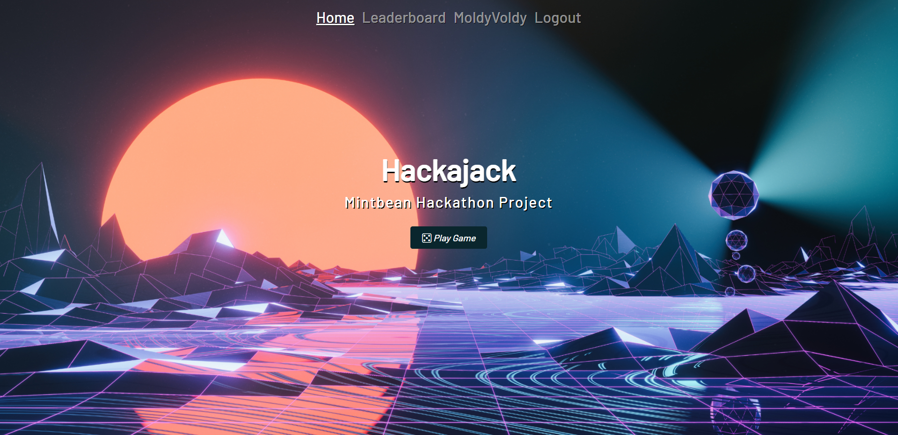
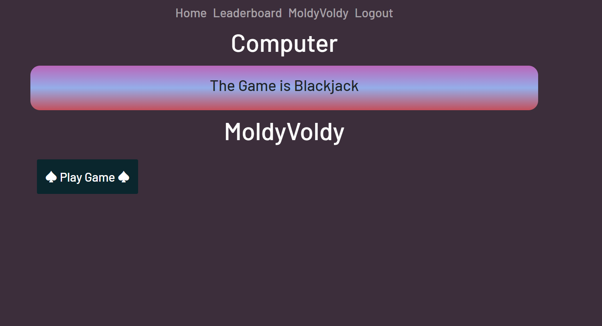
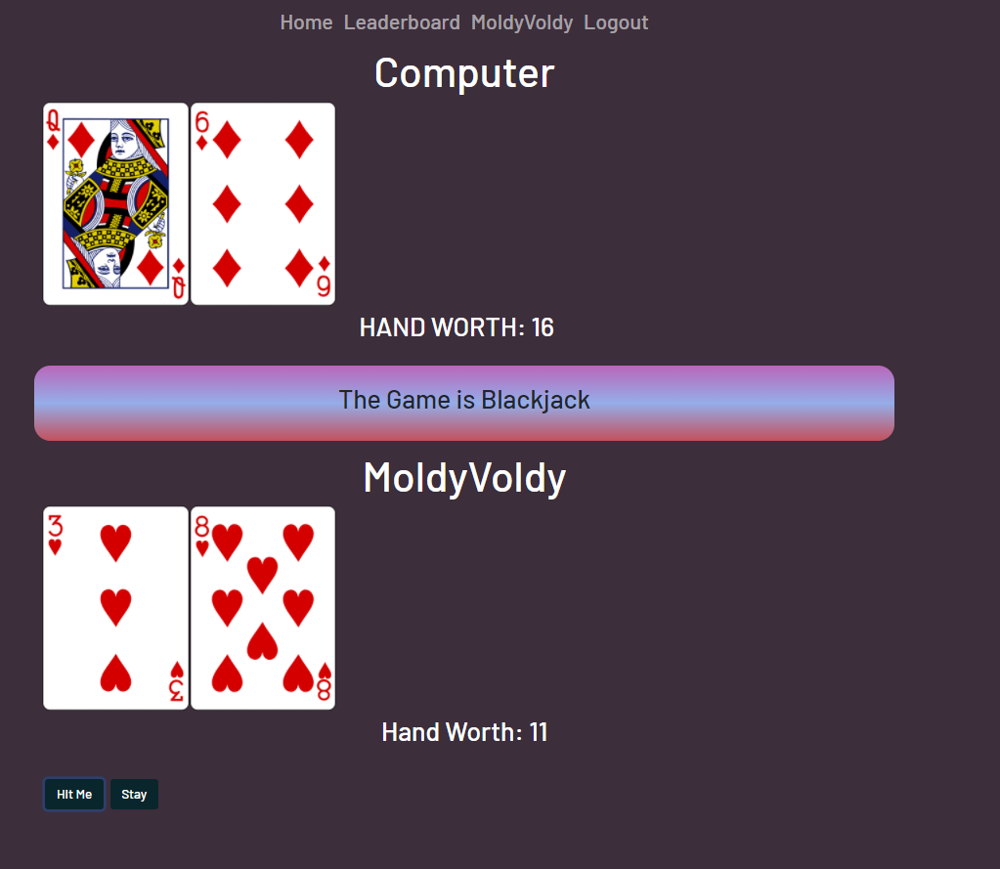
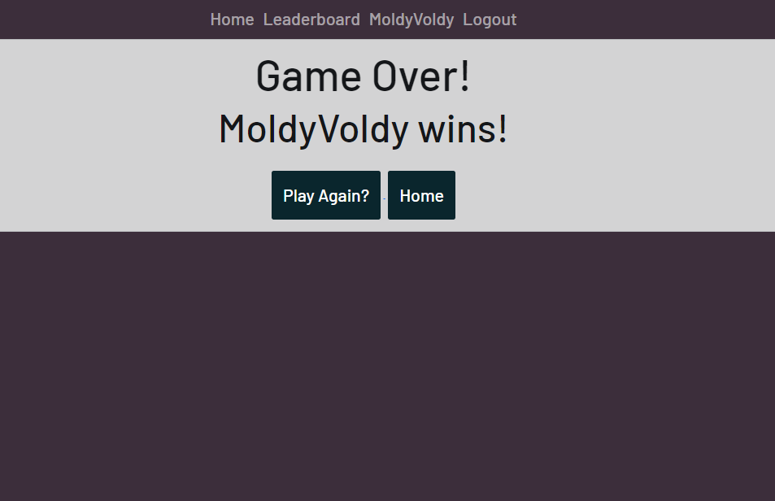
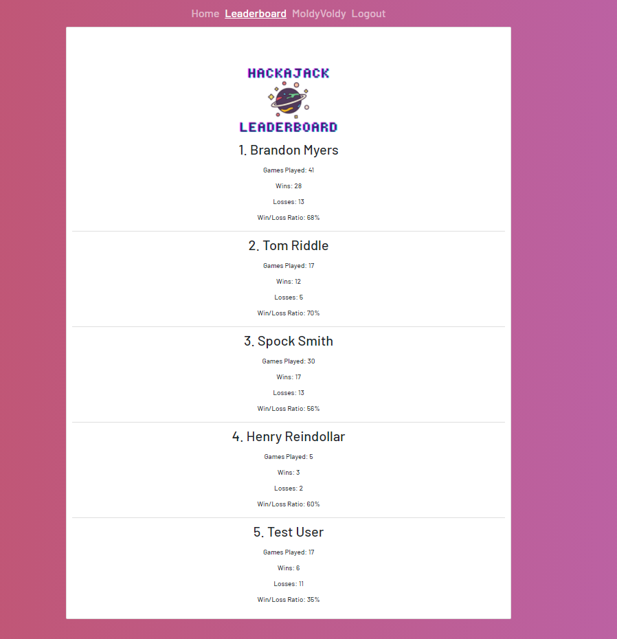
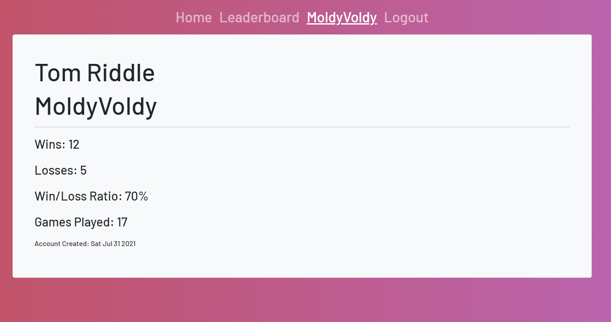

# Hackajack: A Hackathon Project

This is a React project for a Hiring Hackathon. The clients purpose is to create a simple version of the card game Blackjack.

https://hackajack-twenty-one.herokuapp.com/

https://github.com/TechAlchemist/twenty-one-api

---

Technologies used in this React include:

    - React.js
    - Bootstrap 5
    - fetch
    - YARN
    - React-Router-DOM
    - 3rd Party API called: https://deckofcardsapi.com/
    - My own created RESTful API here: https://github.com/TechAlchemist/twenty-one-api

---
### Test Users
    - username: TestUser99
    - password: SecurePassword1!
    ---
    - username: MoldyVoldy
    - password: PotterSmells1!
    ---
    - username: pockyPoo
    - password: TrekFan96!
    ---
    - username: ReinsDollars
    - password: GetThisDub1!

--- 

## Screenshots!

## Home Page

--- 

## Game (Not Started)

--- 

## Game (Started)

--- 

## Game (Over)

--- 

## Leaderboard

--- 

## Profile

